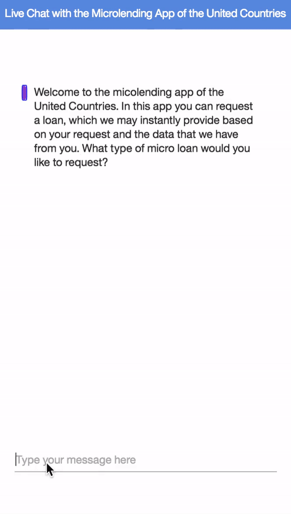

# Watson Assistant Micro Loan Sample Application

## This app doesn't have any commercial purposes
The aim of creating this application was to get familiar with IBM's Watson Assistant. This app has not been created for any commercial use or purposes, just for my personal education. To give the app context and display the possibilities of the app, I created an UX as it was an app for a non-existing organisation called United Countries.

## The concept
The idea was to provide users with the possibility to get a micro loan based on dummy data already available about the user (e.g. employment status) and input provided in the app itself (e.g. type of loan). With the information provided the user sees whether he/she can request a loan and against which interest rate. Lastly, the user can decide to make the loan official. The algorithm has been kept as simple as possible, but could be extended by including additional variables (e.g. level of education).

## Visual Representation App

## Watson Assistant
Many of the functionality of the app is created through the online interface of Watson Assistant. Besides this service, the app communicates with an additional online server of IBM to handle the flow of the conversation. I've added additionally functionality in the repository in order to adapt certain variables (e.g. the total payback amount). For more more information about Watson Assistant [click here](https://www.ibm.com/watson/ai-assistant/).
